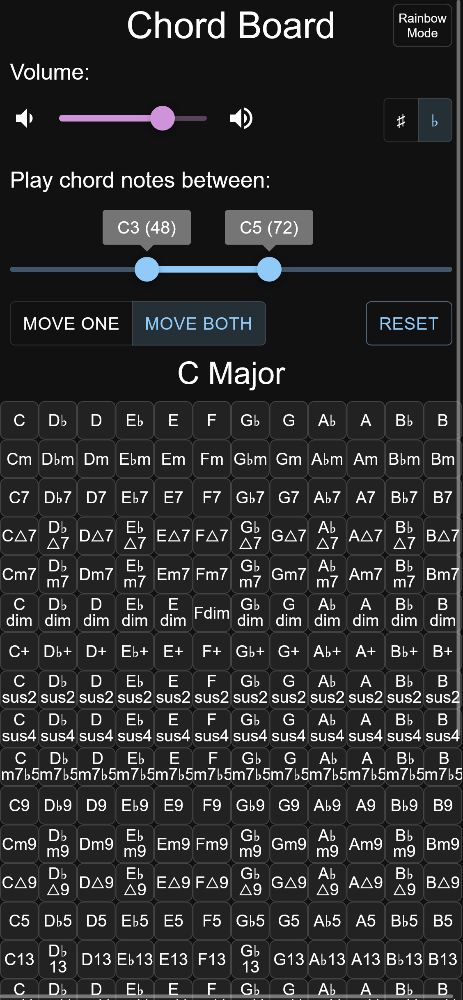

# Chord Board

A simple UI to play every chord you could possibly think of. Uses Tone.js and React.
[https://lunafutures.github.io/chord-board/](https://lunafutures.github.io/chord-board/)

#### Desktop:

#### Mobile:

## Features

- ✅ Works on both desktop and mobile.
- ✅ Long list of chords in every key.
- ✅ Sharp/flat display.
- ✅ Volume control.
- ✅ All settings saved to localstorage.
- ✅ Option for colorful UI.

### Possible future features

- Custom instruments
- Apreggios vs block chords
- History
